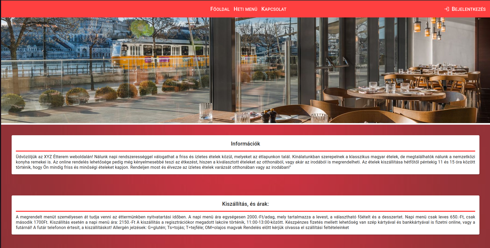

# WebfejlProjectEtel2023

This project was generated with [Angular CLI](https://github.com/angular/angular-cli) version 15.1.6.

Ezt a projektet 2023-ban készítettem, a feladat egy webalkalmazás készítése volt, a webfejlesztési-keretrendszerek gyakorlati kurzusra. A programot Angular keretrendszerben kellett írni, a téma egy online ételrendelésre szolgáló felület volt.

## Funkciók

- **Firebase Hosting URL**: Létezik, és minden végpont megfelelő módon betöltődik.
- **Adatmodell definiálása**: Legalább 4 TypeScript interfész vagy class formájában (ugyanennyi kollekció).
- **Komponens felépítés**: Az alkalmazás megfelelő számú komponensre van bontva (egyetlen komponens TS és HTML kódja sem haladja meg a 250 sort és soronként a 400 karaktert).
- **Reszponzív, mobile-first felület**: Minden adat látható és jól jelenik meg böngészőben, mobil nézetben is.
- **Attribútum direktívák**: Legalább 2 különböző attribútum direktíva használata.
- **Strukturális direktívák**: Legalább 2 különböző strukturális direktíva használata.
- **Adatátadás komponensek között**: Legalább 1 @Input és 1 @Output megvalósítva.
- **Material Design elemek**: Legalább 10 különböző Angular Material elem helyes használata.
- **Adatbevitel Angular formokkal**: Legalább 2 Angular form megvalósítva.
- **Pipe osztály**: Legalább 1 saját Pipe osztály írása és használata.
- **Lifecycle Hooks**: Legalább 2 különböző Lifecycle Hook használata a projektben (értelmes tartalommal, nem üresen).
- **CRUD műveletek**: Mindegyik CRUD művelet megvalósult (Promise, Observable használattal).
- **Service-ek használata**: A CRUD műveletek service-ekbe vannak kiszervezve és megfelelő módon injektálva.
- **Firestore adatbázis**: Firestore adatbázis használata az adatok tárolására (integráció és környezeti változók helyes használata).
- **Route-ok**: Legalább 4 különböző route a különböző oldalak eléréséhez.
- **Route védelme azonosítással**: Legalább 2 route levédése AuthGuard segítségével (pl. a regisztrált felhasználó adatai nem láthatók bárki számára).

